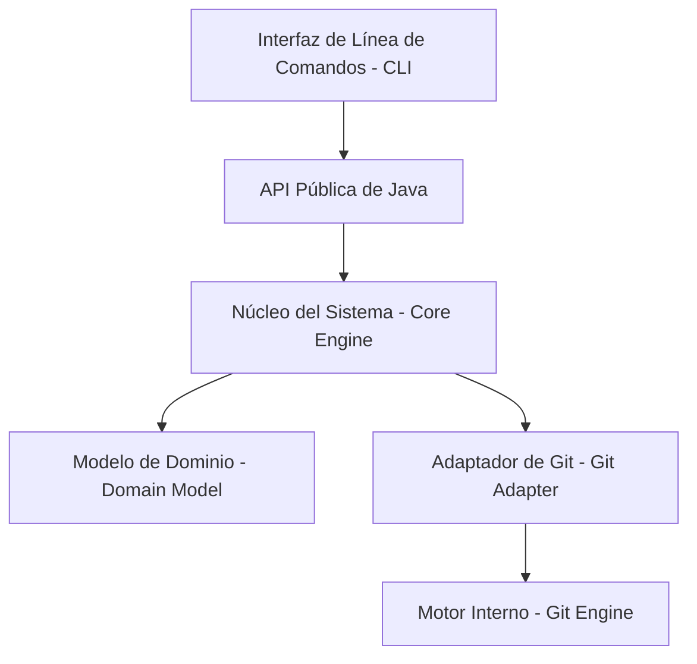

# Arquitectura del Sistema — LIT (Light Intelligent Tracking)

Este documento describe la arquitectura de alto nivel de LIT, incluyendo sus capas, componentes y el flujo de dependencias permitido.

---

## Diagrama de Alto Nivel

A continuación se muestra cómo se organiza el sistema de forma conceptual:

---

## Capas y Componentes

El sistema está estructurado en cuatro capas principales con responsabilidades claramente delimitadas:

### 1. Capa de Presentación (CLI)
* **Responsabilidad**: Interactuar de forma directa con el usuario a través de la terminal. Analiza los comandos recibidos y muestra respuestas legibles y formateadas de manera agradable.
* **Dependencias**: Solo puede depender de la **Capa de Aplicación (API Pública de Java)**.

### 2. Capa de Aplicación (API Pública)
* **Responsabilidad**: Exponer los servicios de LIT a integraciones de terceros (IDE, herramientas gráficas) y a la propia CLI. Coordina los flujos de control del sistema de forma agnóstica a la interfaz de usuario.
* **Dependencias**: Depende directamente de la **Capa de Dominio (Core Engine)**.

### 3. Capa de Dominio (Core Engine & Domain Model)
* **Responsabilidad**: Contiene las entidades esenciales (`Repository`, `Workspace`, `Snapshot`, `Task`, `Conflict`, `History`, `Remote`) y las reglas de negocio puras de LIT. Realiza validaciones y orquesta las operaciones sin conocer detalles del almacenamiento.
* **Dependencias**: Es una capa pura. No depende de bases de datos, sistemas de archivos concretos ni de Git. Sus interfaces de persistencia se inyectan a través del **Adaptador de Git**.

### 4. Capa de Adaptadores e Infraestructura (Git Adapter)
* **Responsabilidad**: Traducir las peticiones del Core de LIT al formato físico y operaciones de Git. Actúa como el puente que lee y escribe el estado de Git en el disco duro.
* **Dependencias**: Depende de librerías externas de Git (por ejemplo, comandos de Git del sistema o JGit) y del **Modelo de Dominio** (para implementar sus interfaces de persistencia).

---

## Reglas de Dependencia Permite

Para mantener una arquitectura mantenible y modular, se deben respetar de forma estricta las siguientes restricciones de dependencias:

1. **Aislamiento del Dominio**: El Core del Dominio no puede importar ninguna clase relacionada con la CLI ni con Git.
2. **Inyección de Dependencias**: La capa de dominio define interfaces para las operaciones de almacenamiento, y la capa de infraestructura (Git Adapter) implementa estas interfaces.
3. **Flujo de llamadas**: Las llamadas viajan exclusivamente de arriba hacia abajo (CLI -> API -> Core -> Adapter -> Git). Ninguna capa inferior puede iniciar llamadas directas a capas superiores.
