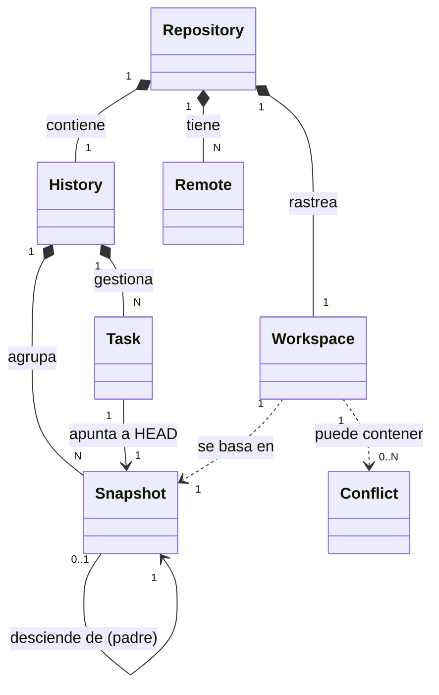

# Modelo de Dominio — LIT

Este documento describe las entidades conceptuales fundamentales del proyecto LIT y sus relaciones. El modelo de dominio es agnóstico a la implementación física y al motor subyacente (Git).

---

## 1. Repository (Repositorio)

El `Repository` es la entidad raíz del dominio de LIT. Actúa como el contenedor principal de toda la información y la lógica de alto nivel asociada a un proyecto.

### Responsabilidades
- Proveer el punto de entrada principal para la inicialización y gestión del ciclo de vida del proyecto.
- Actuar como agregador de la configuración persistente del proyecto (p. ej., reglas de ignorado, nombre de autor).
- Servir de puerta de acceso a otras entidades maestras como el `History` (Historial) y los `Remote`s (Remotos).

### Relaciones principales
- **Contiene 1 `History`**: El historial global inmutable de todos los Snapshots y flujos de trabajo.
- **Contiene N `Remote`s**: Las conexiones y metadatos hacia servidores de sincronización externos.
- **Está asociado a 1 `Workspace`**: Aunque están conceptualmente separados (ver [ADR-0001](../adr/ADR-0001.md)), el repositorio gestiona y rastrea el estado de los archivos físicos a través del `Workspace`.

### Atributos Conceptuales
* `id` / `path`: Identificador único o la ruta base del proyecto en el sistema de archivos.
* `config`: Configuración general del repositorio LIT.
* `remotes`: Colección de repositorios remotos configurados.
* `history`: Instancia que maneja la secuencia de Snapshots y Tasks.

*Nota: Las implementaciones concretas de este dominio en código (Fase 4) inyectarán la capa de persistencia (Git Adapter) para leer y materializar estas propiedades conceptuales.*

---

## 2. Workspace (Espacio de Trabajo)

El `Workspace` representa la realidad física e inmediata de los archivos del proyecto en el disco local del desarrollador. Es la única entidad mutable por el usuario a nivel de archivos, donde ocurren las ediciones, creaciones y eliminaciones cotidianas.

### Responsabilidades
- Reflejar el estado actual y no guardado (uncommitted) del proyecto.
- Actuar como el origen de datos (source of truth actual) al momento de tomar un `Snapshot`.
- Servir como el entorno donde se materializan las modificaciones procedentes de otras `Task`s o de un `Remote` (p. ej. al cambiar de contexto de trabajo o al sincronizar).
- Alojar e identificar las discrepancias que requieran resolución manual (`Conflict`s).

### Relaciones principales
- **Pertenece a 1 `Repository`**: El repositorio rastrea el Workspace de forma exclusiva.
- **Transiciona a `Snapshot`**: El estado del Workspace puede congelarse y persistirse generando un nuevo `Snapshot`.
- **Es independiente del Staging Area**: En el dominio de LIT no existe el concepto de "Index" o "Staging Area". El Workspace transiciona directamente a Snapshot en un solo paso conceptual (ver [ADR-0002](../adr/ADR-0002.md)).

### Atributos Conceptuales
* `path`: Directorio físico raíz donde residen los archivos.
* `untrackedFiles`: Archivos nuevos que el sistema detecta pero aún no están siendo seguidos.
* `modifiedFiles`: Archivos seguidos cuyo contenido actual difiere del Snapshot activo.
* `deletedFiles`: Archivos seguidos que han sido eliminados del disco.
* `conflicts`: Lista de `Conflict`s activos en el espacio de trabajo que bloquean la toma de nuevos Snapshots.

---

## 3. Snapshot (Captura de Estado)

El `Snapshot` representa un registro inmutable y estático de la totalidad de archivos rastreados en el proyecto en un punto específico del tiempo. Es la unidad básica de almacenamiento histórico en LIT.

### Responsabilidades
- Registrar de forma persistente y no modificable el contenido exacto de los archivos del Workspace en el instante de su creación.
- Almacenar metadatos explicativos para auditoría y revisión (quién, cuándo y por qué se guardaron los cambios).
- Mantener la topología del historial mediante referencias a su Snapshot predecesor (padre).

### Relaciones principales
- **Pertenece a 1 `History`**: Es un nodo dentro de la estructura general de evolución del proyecto.
- **Tiene 0 o 1 Snapshot Padre**: Todo Snapshot (excepto el inicial) tiene un único predecesor directo del cual desciende.
- **Es apuntado por `Task`**: Las tareas apuntan a Snapshots específicos para denotar el estado más reciente de esa línea de trabajo.

### Atributos Conceptuales
* `id`: Identificador único (hash criptográfico o cadena corta legible) que lo distingue de cualquier otra captura.
* `parent`: Referencia al `id` del Snapshot anterior en la línea de tiempo.
* `message`: Texto libre descriptivo proporcionado por el autor.
* `timestamp`: Fecha y hora exacta de creación.
* `author`: Metadatos del desarrollador que guardó el Snapshot.
* `fileTree`: El mapa o instantánea física de rutas y contenidos de los archivos capturados.

---

## 4. Task (Tarea)

La `Task` representa un flujo de trabajo o línea de progreso en la evolución del proyecto. Permite aislar cambios lógicos (características, correcciones) para que los desarrolladores trabajen de forma segura en paralelo.

### Responsabilidades
- Identificar y nombrar de forma única un flujo de trabajo de desarrollo (p. ej., `main`, `refactor-login`).
- Apuntar de forma dinámica al Snapshot más reciente (la punta de la tarea) en dicha línea de progreso.
- Gestionar su propio estado de guardado transitorio cuando el desarrollador cambia de contexto (stashing automático de cambios locales).

### Relaciones principales
- **Pertenece a 1 `History`**: Forma parte del abanico de líneas de trabajo del repositorio.
- **Apunta a 1 `Snapshot`**: Rastrea cuál es la captura activa en esa tarea.
- **Se asocia al `Workspace`**: Cuando una tarea está activa, define cuál debe ser la base de los archivos en disco del usuario.

### Atributos Conceptuales
* `name`: Nombre descriptivo único (p. ej. `hotfix-auth`).
* `headSnapshot`: Referencia al Snapshot más reciente perteneciente a esta Tarea.
* `cachedChanges`: Espacio de almacenamiento temporal que guarda automáticamente los cambios del Workspace sin guardar cuando la tarea pasa a estar inactiva.

---

## 5. History (Historial)

El `History` representa la estructura global del repositorio. Es la colección ordenada y conexa de todos los Snapshots y Tasks creados a lo largo del tiempo.

### Responsabilidades
- Mantener la integridad de la cronología de cambios del proyecto.
- Permitir la navegación bidireccional por los Snapshots (hacia el pasado o hacia el futuro).
- Orquestar la creación de nuevas `Task`s a partir de Snapshots existentes.

### Relaciones principales
- **Pertenece a 1 `Repository`**: Es el motor histórico del repositorio.
- **Agrupa N `Snapshot`s**: Los Snapshots son los nodos del historial.
- **Agrupa N `Task`s**: Las Tasks son las etiquetas dinámicas que marcan rutas alternativas en el historial.

### Estructura
Formalmente, el Historial se modela como un **Grafo Acíclico Dirigido (DAG)** de Snapshots, donde los nodos son capturas inmutables y las aristas son referencias hacia los padres. A diferencia de Git, la navegación y visualización de este grafo se simplifica eliminando la visibilidad de los merges complejos, promoviendo una visualización lineal siempre que sea posible.

---

## 6. Conflict (Conflicto)

El `Conflict` representa una incompatibilidad entre dos conjuntos de cambios sobre el mismo archivo o línea de código que el sistema no puede resolver automáticamente, requiriendo intervención humana.

### Responsabilidades
- Identificar de forma unívoca el archivo afectado en el disco.
- Delimitar las secciones del archivo donde colisionan los cambios locales y los cambios provenientes de otra Task o Remote.
- Impedir operaciones destructivas o la creación de nuevos Snapshots hasta que se marque como solucionado.

### Relaciones principales
- **Reside en el `Workspace`**: Es un estado temporal y mutable de los archivos en disco.

### Atributos Conceptuales
* `filePath`: Ruta del archivo en conflicto.
* `localContent`: Líneas o fragmentos de código modificados en la tarea actual del usuario.
* `incomingContent`: Líneas o fragmentos de código modificados en la tarea o remoto de origen.
* `resolved`: Indicador booleano que determina si el desarrollador ya seleccionó la versión definitiva para este archivo.

---

## 7. Remote (Remoto)

El `Remote` representa la conexión lógica con un servidor o repositorio externo utilizado para colaborar y respaldar el proyecto en la nube.

### Responsabilidades
- Gestionar la dirección de red (URL) del servidor remoto.
- Proveer los mecanismos para la sincronización de Snapshots locales hacia el exterior y viceversa.
- Definir reglas para la autenticación segura del usuario.

### Relaciones principales
- **Pertenece a 1 `Repository`**: Los remotos se configuran a nivel de repositorio.

### Atributos Conceptuales
* `name`: Nombre descriptivo (p. ej. `origin`).
* `url`: Dirección de conexión (protocolo HTTPS o SSH).

---

## 🔄 Diagrama de Relaciones del Dominio (Mermaid)

El siguiente diagrama ilustra cómo interactúan las entidades conceptuales del modelo de dominio de LIT:

---

## ⚖️ Invariantes y Restricciones del Negocio

Para asegurar la robustez del control de versiones y el cumplimiento del principio "Todo debe poder deshacerse" y "Nunca sorprender al usuario", el modelo de dominio impone las siguientes invariantes lógicas:

1. **Inmutabilidad del Historial**: Una vez creado un `Snapshot`, su contenido, ID, mensaje, fecha y autor son estrictamente inmutables. El historial nunca se sobrescribe; solo se añaden nuevos Snapshots o se crean flujos alternativos.
2. **Dependencia de la Task Activa**: El `Workspace` siempre debe estar asociado a una `Task` activa. No existe el concepto de "desarrollo sin tarea" (equivalente al detached HEAD de Git).
3. **Bloqueo por Conflictos**: No se permite generar un nuevo `Snapshot` (acción de guardar) si el `Workspace` contiene algún `Conflict` cuyo atributo `resolved` sea falso.
4. **Linealidad Temporal**: Un `Snapshot` no puede ser su propio padre ni generar bucles de precedencia. La estructura del `History` es acíclica por definición.
5. **Autoconservación en el Cambio de Tarea**: Al cambiar de `Task` activa, si el `Workspace` actual tiene cambios sin guardar, el sistema los almacena de forma obligatoria en la propiedad `cachedChanges` de la tarea de origen antes de restaurar el estado en disco de la tarea destino.

